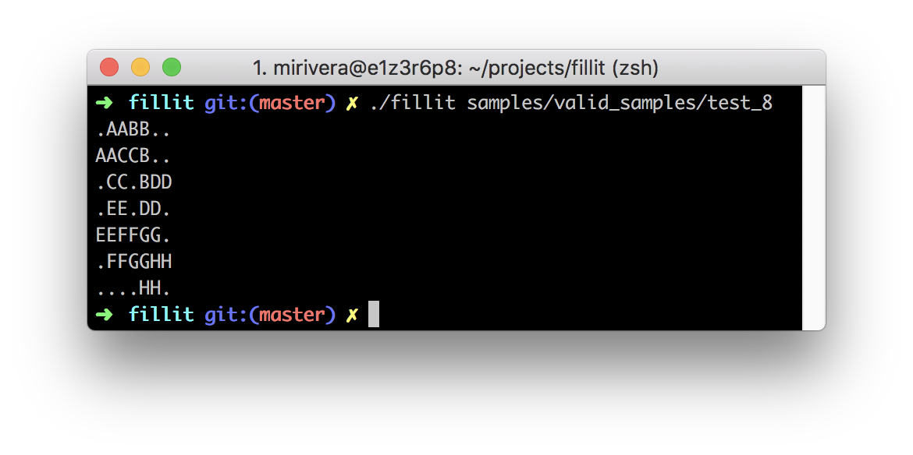

<p align="center">
  <div align="center">
   <br>
    <em><i>I'll never play Tetris again...</i></em>
  </div>
</p>

# Fillit

The goal for this group project is to create an executable that takes only one parameter- an input file which contains a list of Tetriminos to assemble:

<p align="center">
  <div align="center">
   <br>
  </div>
</p>

The algorithm must arrange the Tetriminos into the **smallest possible square**, keeping the given order from the input file, **starting from the top left**. There can only be a maximum of 26 tetriminos.

During the project, my partner and I decided we'd place our tetriminos into a 2D array in memory. We then looped through and placed each piece onto a board displayed via ```STDOUT```. You can follow our thought process by checking out our commented code here; [our main](main.c), [validation functions](validate.c), [solver functions](solve.c). 

Writing Fillit to the norm forced me to practice with new, optimized C language syntax. I was exposed to various algorithmic concepts, such as, backtracking and recursive functions. 

**Project Document:**
[Fillit.pdf](https://github.com/micriver/get_next_line/blob/master/docs/get_next_line.en.pdf)

All functions were written according to 42's coding standard,
[the Norm](https://github.com/micriver/docs/norme.en%20.pdf).


## Installation

Download the repository by copying and pasting the commands below.

```bash
git clone https://github.com/micriver/Fillit.git
cd Fillit
```

You can compile the ```./fillit``` executable using the Makefile:

Command       |  Action
:-------------|:-------------
`make`        | Compile the executable.
`make clean`  | Remove object files.
`make fclean` | Remove object files and the executable.
`make re`     | Re-compile the executable.

## Usage

After compilation, you can run the ```./fillit``` executable with one of the valid input files from ```samples/valid_samples/```.

<p align="center">
  <div align="center">
   <br>
  </div>
</p>

